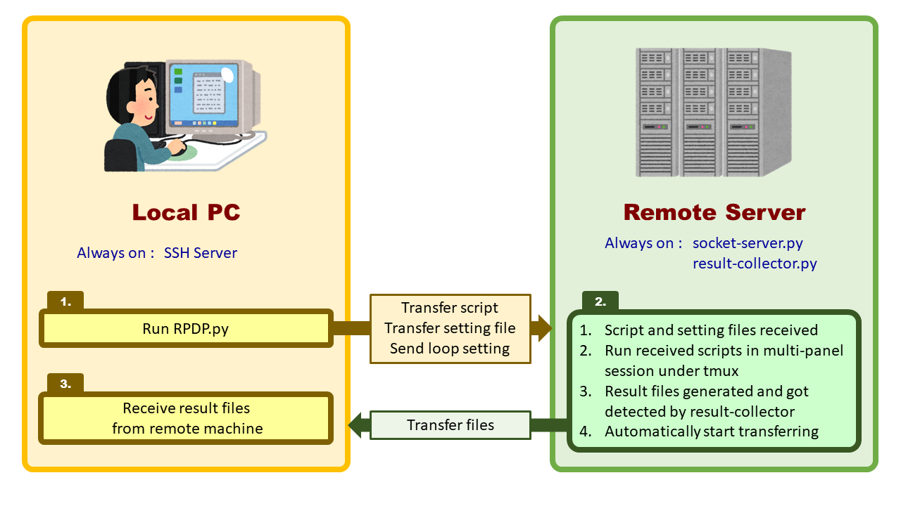
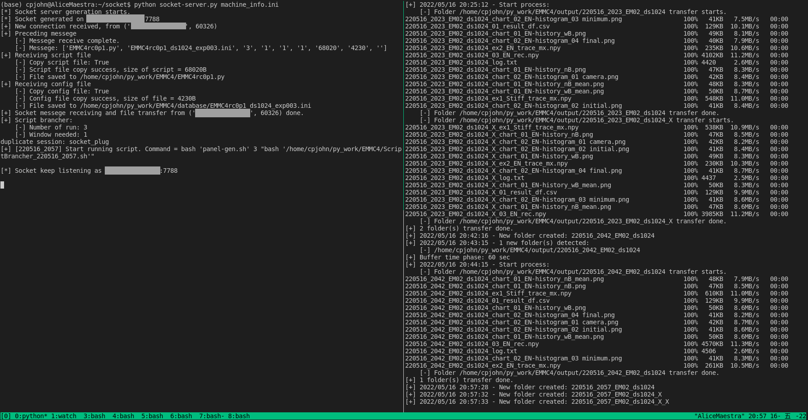
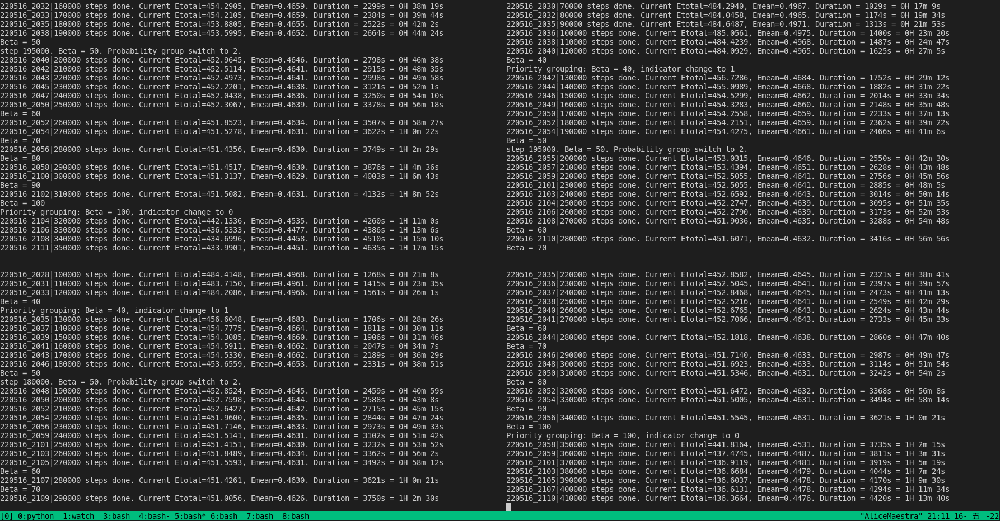

# Remote-Multi-Run

This set of scripts can help you transferring python script and setting file to remote machine and generate multiple runs in individual windows easily. Result files of executed script will be automatically returned to local PC.

# How to use

## 0. System Requirements
|  |  | Local PC| Remote Machine |
| :-: | - | - | - |
| Software |  | ssh server | tmux<br/>scp |
| Python<br/>module |  | socket<br/>argparse | socket<br/>argparse<br/>configparser<br/>subprocess<br/>watchdog |

## 1. Enviornment setup
Turn on SSH server function on local PC in order to receive result files from remote machine. Put files in "Local" folder on local PC and files in "Remote" folder on remote machine. Run socket-server.py and result-collector.py on remote machine with command below. Remember to edit machine_info.ini to meet your working enviornment, such as IP, port, paths of some folders.

```
$ python socket-server.py machine_info.ini
$ python result-collector.py machine_info.ini
```

### Notice that:
- Remember to open firewall port for ssh and socket service.
- In order to avoid entering password every time new file being transfered, creating public and private key pair is recommanded. You can refer to [this article](https://alvinalexander.com/linux-unix/how-use-scp-without-password-backups-copy/).

## 2. Run Remote-Multi-Run.py

1. Run Remote-Multi-Run.py on local PC with options below:
    ```
    $ python script-spreader.py <path of script file> <path of config file>
    ```
    options:

    | Short | Long | Default | Description |
    | - | - | - | - |
    | -r | --process | 1 | Number of seperated processes (panels). |
    | -l | --loop | 10 | Number of loops in each panel. |
    | -a | --addr | 192.168.1.1 | Address of remote machine. |
    | -p | --port | 7788 | Port for accessing remote machine. |
    | -cs | --copyscript | - | Would copy script file from local if applied |
    | -cc | --copyconfig | - | Would copy config file from local if applied |
2. Remote machine starts working on generating multi-window session and bash script automatically right after messeges and files received.
3. Remote machine starts running received script file.
4. Result files will be transfered to local PC automatically due to the monitoring of result-collector.py.

### Notice that:
- In current version result-collector.py only supports monitoring folder generation. It detects folder generated in specified output directory and transfers all the files contained in the folder recursively. This is due to the private usage of the author and will be updated to file-generation compatible in the future.
- Files won't be transfered right after generated. We set a buffer time (60 sec.) for waiting file generation complete.



# Screenshots


socket-server.py (left) and result-collector.py (right) running.


The window of terminal on remote machine is devided into 4 panels in every window by tumx, every panel individually runs same script received from local PC.
